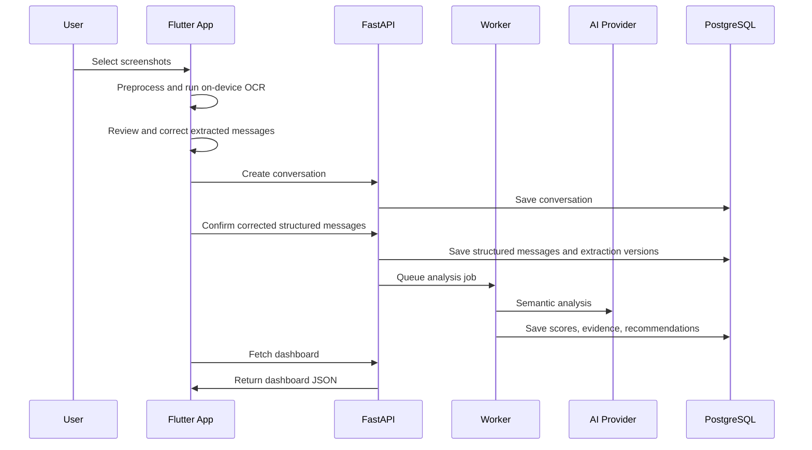

# ConvoCoach AI System Architecture

## 1. Purpose

This document defines the complete end-to-end AI processing architecture for ConvoCoach.

It explains how screenshots, pasted conversations, profile data, user preferences and conversation history move through the system to produce:

- Structured conversations
- Deterministic analytics
- Semantic AI analysis
- Confidence scores
- Evidence-backed insights
- Safety warnings
- Recommended next actions
- Reply suggestions
- First-message suggestions
- Progress reports

This document is the technical source of truth for the ConvoCoach Intelligence Engine.

`Conversation-Event-Spec.md` is the canonical source for the event types,
relationships, confidence fields, review behavior, analytics inclusion rules and
persistence direction that feed this engine. Phase 6A.1 implements the typed
runtime and an explicit message compatibility projection. It does not authorize
this AI engine, deterministic analytics, scoring, or generation to consume the
events; native qualification and a later explicit phase remain required.

---

## 2. Architecture Principles

The AI system must follow these principles:

1. Deterministic calculations must be performed in normal backend code.
2. The language model must not invent message counts, timings or ratios.
3. Every AI conclusion must include evidence.
4. Every insight must include a confidence level.
5. Raw screenshots should be deleted after processing by default.
6. Raw conversations must never appear in logs or analytics.
7. The system must separate extraction, analytics, scoring and recommendation.
8. AI providers must be replaceable through an abstraction layer.
9. Expensive processing must run in background jobs.
10. The system must fail safely when extraction or AI output is uncertain.
11. When this document conflicts with implementation details, the conflict must be recorded in `docs/decision-log.md` and the architecture document must be updated before the implementation is considered complete.
---

## 3. High-Level System Architecture

```mermaid
flowchart LR
    A[Flutter Mobile App]
    B[FastAPI Backend]
    C[Private Object Storage]
    D[OCR Layer]
    E[Conversation Normalizer]
    F[Deterministic Analytics Engine]
    G[AI Semantic Analysis]
    H[Scoring Engine]
    I[Confidence Engine]
    J[Evidence Engine]
    K[Recommendation Engine]
    L[PostgreSQL]
    M[Redis / Background Workers]

    A --> D
    D --> A
    A --> B
    B -. future fallback .-> C
    B --> M
    B --> E
    E --> F
    E --> G
    F --> H
    G --> H
    H --> I
    I --> J
    J --> K
    K --> L
    L --> B
    B --> A
````

---

## 4. End-to-End Processing Pipeline

The complete pipeline is:

1. User selects screenshots or pastes text.
2. Mobile validates file type, count, dimensions and size.
3. Mobile corrects orientation, resizes, normalizes contrast and removes metadata.
4. On-device OCR extracts text structure and bounding boxes.
5. Provider-neutral strategies group candidate messages, estimate speakers,
   resolve visible timestamps, order screenshots and remove overlap duplicates.
6. User reviews and corrects the conversation.
7. Confirmed messages are normalized into structured JSON.
8. Only confirmed structured messages are sent to the backend.
9. Deterministic metrics are calculated.
10. Semantic AI analysis is performed.
11. The scoring engine combines deterministic and semantic signals.
12. The confidence engine estimates reliability.
13. The evidence engine attaches observable evidence.
14. The recommendation engine determines the next action.
15. Dashboard JSON is stored.
16. Mobile app displays the results.
17. Raw screenshots are deleted after confirmation or import abandonment.

---

## 5. Conversation Input Layer

Supported MVP inputs:

* Chat screenshots
* Pasted text
* Dating profile screenshots
* Manually entered profile text

Not supported in MVP:

* Direct WhatsApp account connection
* Tinder account access
* Bumble account access
* Instagram account access
* Background message reading
* Account scraping

Input validation must check:

* MIME type
* File extension
* File size
* Maximum number of screenshots
* Corrupted images
* Duplicate screenshots
* Unsupported formats

---

## 6. Temporary Storage Layer

The primary mobile extraction path keeps screenshots in bounded on-device
temporary memory and never uploads them. Private object storage applies only to a
future explicit backend fallback and is not part of Phase 5.

Requirements:

* No public bucket
* Signed URLs only
* Random file names
* Metadata stripping
* Environment separation
* Automatic deletion policy
* Retention only with explicit consent

Default screenshot lifecycle:

1. Store selected bytes temporarily on-device.
2. Create a metadata-free temporary image for on-device OCR.
3. Delete each recognizer working file after its attempt.
4. Keep original bytes only while the user needs `View Original` and correction.
5. Preserve the user-confirmed structured transcript.
6. Clear original bytes after save or import abandonment.
7. Record deletion status without recording screenshot contents.

---

## 7. OCR Architecture

Preferred OCR order:

1. On-device OCR using Google ML Kit
2. User correction
3. Backend normalization
4. Multimodal model fallback when layout is unclear

The OCR and layout-recognition output is a sequence of draft conversation events.
Phase 6A.1 retains a filtered message projection for older callers, but Review
Studio and normalization operate on the full typed sequence. Output includes:

```json
{
  "events": [
    {
      "id": "uuid",
      "position": 1,
      "event_type": "text_message",
      "speaker": "user",
      "text": "How was your weekend?",
      "timestamp": "2026-07-13T19:10:00+05:30",
      "timestamp_is_estimated": false,
      "source_image_index": 0,
      "source_region_id": "region-12",
      "ocr_confidence": 0.94,
      "classification_confidence": 0.91,
      "speaker_confidence": 0.97,
      "timestamp_confidence": 0.90,
      "requires_review": false,
      "metadata": {}
    }
  ]
}
```

The OCR layer must preserve:

* Message order
* Emojis
* Visible timestamps
* Reactions
* Reply relationships where possible
* Deleted-message markers
* Speaker side
* Source screenshot index

Reactions, emoji-only messages, media, calls, deleted-message markers, reply
references, structural events and unknown content remain distinct event types.
An unknown classification is valid output and must require user review. The
complete rules are defined in `Conversation-Event-Spec.md`.

---

## 8. Conversation Review Layer

Before analysis, the user must be able to:

* Swap speakers
* Edit text
* Delete messages
* Add missing messages
* Reorder messages
* Correct timestamps
* Mark timestamps as unavailable
* Add context
* Cancel processing

No analysis should begin until the conversation is confirmed.

---

## 9. Conversation Normalization

The normalization layer converts extracted data into a consistent schema.

Responsibilities:

* Remove OCR noise
* Preserve meaning
* Standardize speaker labels
* Normalize timestamps
* Detect duplicates
* Merge split message bubbles
* Preserve emojis
* Preserve language
* Detect English and Hinglish
* Avoid rewriting user text unnecessarily

Canonical speaker values:

* user
* other
* unknown

---

## 10. Deterministic Analytics Engine

This engine uses normal Python code.

It calculates:

* Message count per speaker
* Word count per speaker
* Character count per speaker
* Average message length
* Median message length
* Question count
* Follow-up question count
* Consecutive messages
* Double-texting frequency
* Conversation initiation ratio
* Topic initiation ratio
* Reply-time average
* Reply-time median
* Reply-time trend
* Longest response gap
* Emoji frequency
* Message-length trend
* Participation ratio
* Last-message author
* Topic closure frequency

These values must never be produced by the language model.

---

## 11. Semantic AI Analysis

The AI layer evaluates:

* Tone
* Warmth
* Humour
* Curiosity
* Reciprocity
* Emotional openness
* Topic contribution
* Conversation flow
* Possible misunderstandings
* Boundary respect
* Scam signals
* Coercive language
* Requests for money
* Suspicious links
* Conversation momentum
* Appropriate next action

The AI must use:

* Structured conversation
* Deterministic metrics
* User communication profile
* Relationship stage
* User-provided context

The AI must not infer:

* True feelings
* Personality disorders
* Mental-health conditions
* Wealth
* Religion
* Caste
* Sexual orientation
* Guaranteed attraction

---

## 12. AI Provider Abstraction

Create interfaces such as:

```python
class ConversationAnalysisProvider:
    async def analyse(self, payload):
        ...

class ReplyGenerationProvider:
    async def generate(self, payload):
        ...

class FirstMessageProvider:
    async def generate(self, payload):
        ...

class WeeklyReportProvider:
    async def generate(self, payload):
        ...
```

The application must support:

* OpenAI provider
* Mock provider
* Future alternative providers

Model names must come from environment variables.

---

## 13. Scoring Engine

The scoring engine combines:

* Deterministic metrics
* Semantic labels
* Relationship stage
* Safety results
* Data completeness
* Historical trend

Required metrics:

* Conversation Health
* Engagement
* Reciprocity
* Balance
* Momentum
* Curiosity
* Warmth
* Clarity
* Initiative
* Question Balance
* Date Readiness
* Safety

The detailed formulas belong in:

`docs/AI-Scoring-Engine.md`

This architecture document should reference that file rather than duplicating every formula.

---

## 14. Confidence Engine

Confidence depends on:

* Number of messages
* Conversation duration
* Timestamp completeness
* OCR confidence
* Speaker certainty
* Missing screenshots
* Consistency of signals
* Whether evidence is recent
* Whether signals conflict

Example confidence rules:

```text
Low:
- Fewer than 10 messages
- Missing timestamps
- Low OCR confidence
- Conflicting signals

Medium:
- 10–50 messages
- Partial timestamps
- Moderate consistency

High:
- 50+ messages
- Good timestamp coverage
- High OCR confidence
- Consistent evidence
```

Every metric must include a confidence level.

---

## 15. Evidence Engine

Every conclusion must be tied to observable evidence.

Evidence may include:

* Message IDs
* Reply-time trend
* Question counts
* Topic initiation
* Message-length changes
* Unanswered messages
* Direct quotes limited to short excerpts
* Behavioural pattern descriptions

Example:

```json
{
  "metric": "engagement",
  "score": 76,
  "confidence": "medium",
  "evidence_message_ids": [
    "msg-12",
    "msg-18",
    "msg-25"
  ],
  "evidence": [
    "The other person asked three follow-up questions.",
    "Recent replies contain more detail than earlier replies."
  ]
}
```

---

## 16. Recommendation Engine

The recommendation engine produces the next best action.

Allowed actions:

* Continue topic
* Ask an open-ended question
* Share a personal detail
* Change topic
* Suggest a call
* Suggest a date
* Give space
* Clarify misunderstanding
* Respect boundary
* End conversation
* Safety warning

Every recommendation must include:

* Action
* Why
* Evidence
* Confidence
* Alternative interpretation
* Risk

---

## 17. Safety Classification

Safety checks should run separately from engagement analysis.

Detect:

* Requests for money
* Blackmail
* Threats
* Harassment
* Sexual pressure
* Suspicious links
* Identity inconsistencies
* Pressure to share private photos
* Coercion
* Stalking behaviour

Safety levels:

* none
* caution
* elevated
* serious

Safety concerns must override flirtation or date-readiness recommendations.

---

## 18. Reply Generation Architecture

Reply generation inputs:

* Last relevant messages
* Conversation summary
* Dashboard metrics
* Recommended next action
* User writing style
* Preferred language
* Relationship stage
* Safety state

Output:

* Natural reply
* Playful reply
* Direct reply
* Why each may work
* Risk
* Confidence
* Intended effect

Replies must never be sent automatically.

---

## 19. First Message Generator Architecture

Inputs:

* Profile screenshot
* Extracted bio
* Prompt answers
* Visible interests
* User tone preference

Pipeline:

1. Extract observable profile details.
2. Show extracted details to the user.
3. User confirms or corrects.
4. Generate three hooks.
5. Generate three opener styles.
6. Run safety and sensitivity checks.
7. Return explanation and confidence.

---

## 20. Background Job Architecture

Use background jobs for:

* Future backend OCR fallback
* Profile extraction
* Conversation analysis
* Reply generation
* Weekly reports
* Screenshot deletion
* Data export
* Account deletion

Job states:

* queued
* processing
* completed
* failed
* cancelled

Use Redis with Celery or Dramatiq.

---
Every expensive or destructive background job must use an idempotency key.

Duplicate delivery of a job must not:

- create duplicate analyses
- charge the user twice
- retain duplicate uploads
- delete unrelated records
- generate duplicate weekly reports

## 21. API Interaction Flow



---

## 22. Failure Handling

Possible failures:

* OCR failure
* Unsupported image
* Missing speaker assignment
* Invalid AI JSON
* AI timeout
* Provider unavailable
* Storage failure
* Database failure
* Background-job failure
* User cancellation

Rules:

* Never lose confirmed user edits
* Retry transient failures
* Retry invalid AI schema once
* Do not endlessly retry
* Show clear user-facing error messages
* Log technical error metadata only
* Never log raw private conversations

---

## 23. Retry Strategy

Recommended:

* OCR transient failure: retry up to 2 times
* AI timeout: retry up to 2 times with exponential backoff
* Invalid structured output: retry once with schema repair
* Storage upload failure: retry with idempotency
* Database write failure: rollback transaction
* Background worker failure: mark failed and allow manual retry

---

## 24. Privacy Checkpoints

Privacy checkpoints must exist at:

1. Before upload
2. Before analysis
3. Before saving history
4. Before retaining screenshots
5. Before model processing
6. Before analytics tracking
7. Before data export
8. Before account deletion
9.Before sending content to an AI provider:

- remove unnecessary names
- redact phone numbers and email addresses where practical
- exclude messages unrelated to the requested analysis
- send only the minimum relevant conversation window
- include full history only when required and consented to

Raw content must never be sent to general analytics.

---

## 25. Performance Considerations

Optimise for:

* Image compression before upload
* On-device OCR where possible
* Background processing
* Partial progress updates
* Pagination
* Caching of non-sensitive summaries
* Cancellation of abandoned jobs
* Avoiding repeated AI analysis
* Token-cost tracking
* Model selection by task complexity

---

## 26. Observability

Track:

* Job duration
* OCR success rate
* OCR correction rate
* AI schema failure rate
* Average analysis latency
* Provider errors
* Cost per analysis
* Screenshot deletion success
* User-rated usefulness

Do not track raw conversation content.

---

## 27. Security Architecture

Implement:

* Authentication token verification
* Resource ownership checks
* Signed URLs
* Private storage
* Rate limiting
* Upload limits
* Input validation
* Secret management
* Audit events
* Data deletion verification

---

## 28. Data Retention

Default:

* Screenshots deleted after confirmed extraction or import abandonment
* Structured conversations saved only with consent
* Deleted conversations permanently removed through scheduled cleanup
* Audit logs must not contain message content
* Data export must include only user-owned records

---

## 29. Testing Strategy

Required tests:

* OCR mock tests
* Normalization tests
* Speaker assignment tests
* Deterministic metric tests
* Confidence tests
* Evidence-linking tests
* AI schema validation tests
* Retry tests
* Privacy deletion tests
* Ownership tests
* Background-job tests
* End-to-end conversation-analysis tests
* Original synthetic extraction-fixture tests
* Physical Android and iOS extraction qualification

Use synthetic conversations only.

---

## 30. Implementation Phases

The phase labels in this section describe the future AI subsystem sequence, not
the repository-wide product phases. Repository Phase 5 implements only the real
conversation extraction engine described in
`docs/phase-5-conversation-extraction.md`, and repository Phase 6A qualifies that
engine using the synthetic and physical-device harness in
`docs/phase-6a-native-extraction-qualification.md`. None of the AI milestones
below are implemented by those phases.

Phase 1:
Architecture and data contracts

Phase 2:
Conversation upload and review

Phase 3:
Deterministic analytics

Phase 4:
Semantic AI analysis

Phase 5:
Scoring, confidence and evidence

Phase 6:
Dashboard

Phase 7:
Reply generation

Phase 8:
First-message generation

Phase 9:
History and improvement tracking

---

## 31. Service Ownership Boundaries

### Flutter application

Responsible for:

- file selection
- optional on-device OCR
- user correction
- consent capture
- progress display
- dashboard rendering
- local secure token storage

Must not:

- contain AI-provider secrets
- calculate authoritative scores
- bypass backend ownership checks
- permanently retain screenshots without consent

### FastAPI API

Responsible for:

- authentication verification
- resource ownership
- validation
- orchestration
- database transactions
- API contracts
- privacy actions

### Background workers

Responsible for:

- OCR fallback
- semantic analysis
- deterministic-analysis jobs
- report generation
- deletion and export jobs

### PostgreSQL

Responsible for:

- durable structured records
- ownership relationships
- consent state
- analysis versions
- deletion state

### Object storage

Responsible only for:

- temporary private uploads
- signed access
- lifecycle deletion

### AI provider

Responsible only for:

- bounded semantic tasks
- structured output generation

The AI provider is not the system of record.

## 32. Known Limitations

The system cannot:

* Know another person’s true intentions
* Guarantee attraction
* Guarantee a reply
* Guarantee a date
* Diagnose personality
* Replace judgement
* Interpret missing context perfectly
* Reliably evaluate conversations with very little data

These limitations must be communicated to users.

---

## 33. Definition of Done

The AI system architecture is complete when:

* Every processing stage is documented
* Data contracts are defined
* Failure modes are documented
* Privacy checkpoints are documented
* AI responsibilities and deterministic responsibilities are separated
* Background jobs are defined
* Output schemas are defined
* Testing requirements are defined
* The architecture references `AI-Scoring-Engine.md`

````

After saving this file, commit it:

```bash
git add docs/AI-System-Architecture.md
git commit -m "Document ConvoCoach AI system architecture"
git push origin main
````
