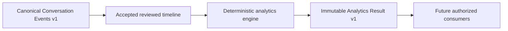

# Deterministic Analytics Specification

**Contract version:** `conversation-analytics.v1`
**Calculation version:** `deterministic-conversation-analytics.v1`
**Status:** Phase 6B canonical specification
**Last updated:** July 2026

## Purpose and boundary

This document is the source of truth for the Phase 6B deterministic analytics
engine. The engine reports reproducible observations over a reviewed canonical
conversation-event timeline. It does not score a relationship, infer interest,
interpret meaning, produce advice, generate text, call an AI provider, or power
a customer dashboard.



The engine is pure backend domain logic. It performs no I/O, logging,
persistence, caching, background work, API transport, or database access. Mobile
does not duplicate the formulas. Phase 6A.3 remains blocked and must pass before
production release; Phase 6B does not reinterpret emulator or host evidence as
physical-device qualification.

## Source and acceptance rules

Input uses `AnalyticsInputV1` and a `ConfirmedConversationEventSequence` with
schema `conversation-events.v1`.

An event contributes only when all of these are true:

- it is active (`deleted_at` is absent);
- it does not require review;
- it is not `unknown`; and
- it is not the source of a valid `duplicate_of` relationship.

An active `requires_review` event makes ordinary analytics unsupported with
`incomplete_review`. A soft-deleted event is treated as rejected and contributes
nothing. A canonical `deleted_message` event is different: it records only the
visible deletion marker and contributes solely to `messages.deleted_markers`.
No deleted content is reconstructed.

### Event sets

| Code | Included canonical types |
| --- | --- |
| `COMM` | `text_message`, `emoji_message`, `image`, `video`, `gif`, `sticker`, `voice_note`, `audio`, `document`, `link`, `location`, `contact_card`, `poll`, `payment_request` |
| `TEXT` | `text_message` |
| `MEDIA` | `image`, `video`, `gif`, `sticker`, `voice_note`, `audio` |
| `ATTACH` | `MEDIA` plus `document`, `contact_card`, `location`, `poll`, `payment_request` |
| `REACTION` | `reaction` |
| `REPLY` | `reply_reference` |
| `STRUCT` | `system_message`, `date_separator`, `unread_separator`, `encryption_notice`, `member_event`, `call_started`, `call_ended`, `missed_call`, `declined_call` |
| `TYPE(x)` | Only the named event type |
| `INPUT` | Conversation-level reviewed input, not an event type |

For every metric below, all canonical event types not named in its Included
column are excluded. The universal acceptance rules above apply before the
metric-specific inclusion rule. Reactions never become messages; reply and edit
references never become participant contributions; structural events never
inflate conversation metrics.

## Relationships

The engine respects `reaction_target`, `reply_target`, `edit_target`,
`duplicate_of`, `media_caption`, `call_pair`, and `system_context` exactly as
provided. It never invents or repairs a target.

- A valid `duplicate_of` source is excluded from ordinary metrics and counted
  once by `structure.duplicates`.
- A valid `reaction_target` must originate from a `reaction` and reference two
  active accepted events.
- A valid `reply_target` must originate from a `reply_reference` and reference
  two active accepted events.
- Missing targets, missing sources, or source/type mismatches produce
  `unresolved_relationship` for affected relationship metrics.
- Relationship evidence contains only relationship and event UUIDs.

## Timing and session rules

Only exact canonical timestamps participate. A missing timestamp or any
`timestamp_is_estimated` value makes affected timing metrics unsupported.
Positions are authoritative for order; a negative timestamp transition is
treated as an incomplete timeline. No timestamp is interpolated or estimated.

Phase 6B uses one fixed mechanical session boundary:

- an adjacent interval of at most 1,800 seconds is active;
- an adjacent interval longer than 1,800 seconds is inactive and starts a new
  observed session; and
- the threshold is a calculation rule only. It does not mean engagement,
  interest, relationship health, or appropriate reply timing.

Response latency is measured only at an adjacent `COMM` speaker change. It is
the non-negative difference between the two exact timestamps. Repeated messages
from the same participant remain part of one consecutive run and do not create
extra response samples.

## Questions and replies

Question detection is deliberately non-semantic: one accepted `text_message`
counts as one question event when its visible text contains at least one literal
`?`. Multiple question marks do not increase the count. The engine does not
classify interrogative grammar, infer whether text answers a question, or read
meaning.

A question is explicitly answered only when a valid `reply_target` targets its
event ID. An accepted `reply_reference` without such a target is an orphan
reply. This is structural bookkeeping, not a claim that the conversational
content was responsive or satisfactory.

`timing.unanswered_question_duration_seconds` is the observed interval from the
earliest explicitly unanswered question to the last accepted communication
timestamp. It is zero when there are no explicitly unanswered questions. It
does not use the current clock and therefore remains reproducible.

## Data-quality model

Every `MetricV1` contains `QualityMetadataV1`:

- `supported` and `unsupported` are complementary;
- `confidence` is `complete`, `reduced`, or `unavailable`;
- `missing_data` is a stable tuple of reason codes;
- `review_status` is `confirmed` or `incomplete_review`; and
- `incomplete_timeline` is explicit.

Confidence describes deterministic evidence sufficiency only. It is not AI
confidence and never expresses certainty about another person.

| Code | `MissingDataReason` | Meaning |
| --- | --- | --- |
| `R` | `incomplete_review` | The timeline or at least one active event is awaiting review. |
| `P` | `partial_conversation` | The caller explicitly marked the supplied conversation partial. |
| `G` | `incomplete_timeline` | A reviewed gap exists or exact timestamp order goes backwards. |
| `U` | `unknown_event` | An active unknown event remains unclassified. |
| `S` | `missing_participant` | A required communication or reaction speaker is unresolved. |
| `T` | `missing_timestamp` | A timing-required communication event has no timestamp. |
| `E` | `estimated_timestamp` | A timing-required timestamp is estimated rather than exact. |
| `L` | `unresolved_relationship` | A required relationship is invalid or has no accepted target. |
| `I` | `insufficient_evidence` | The calculation has no required event or response sample. |

In the catalog, Hard reasons return `value: null`, `unsupported: true`, and
`confidence: unavailable`. Reduced reasons retain only an observed deterministic
value and label it `confidence: reduced`. A blank cell means the metric remains
fully supported when its required fields are present.

## Metric catalog

Every metric exposes its definition at runtime: identifier, description,
formula, included and excluded event types, required fields, unsupported
conditions, structural evidence, and quality.

### Conversation and participation

| Identifier | Formula | Included | Required fields | Hard | Reduced | Evidence |
| --- | --- | --- | --- | --- | --- | --- |
| `conversation.total_communication_events` | Count accepted `COMM`. | `COMM` | type, review, deletion | R P U | G | Counted event IDs |
| `conversation.total_user_events` | Count accepted `COMM` with `speaker=user`. | `COMM` | type, speaker | R P S U G |  | User event IDs |
| `conversation.total_other_events` | Count accepted `COMM` with `speaker=other`. | `COMM` | type, speaker | R P S U G |  | Other event IDs |
| `conversation.duration_seconds` | Last exact `COMM` timestamp minus first exact `COMM` timestamp. | `COMM` | position, timestamp, estimated flag | R P S U G T E I |  | All accepted communication IDs |
| `conversation.active_duration_seconds` | Sum adjacent exact intervals `<= 1800` seconds. | `COMM` | position, timestamp, estimated flag | R P S U G T E I |  | All accepted communication IDs |
| `conversation.inactive_duration_seconds` | Sum adjacent exact intervals `> 1800` seconds. | `COMM` | position, timestamp, estimated flag | R P S U G T E I |  | All accepted communication IDs |
| `conversation.first_event_id` | ID at the minimum accepted `COMM` position. | `COMM` | ID, position | R P I | G U | First event ID |
| `conversation.last_event_id` | ID at the maximum accepted `COMM` position. | `COMM` | ID, position | R P I | G U | Last event ID |
| `participation.conversation_starts` | One for a non-empty timeline plus every exact adjacent interval over 1,800 seconds. | `COMM` | speaker, position, timestamp, estimated flag | R P S U G T E I |  | Session-start event IDs |
| `participant.user.communication_events` | Count accepted user `COMM`. | `COMM` | type, speaker | R P S U G |  | User event IDs |
| `participant.user.participation_share_percent` | `100 * user COMM / all COMM`, rounded to six decimals. | `COMM` | type, speaker | R P S U G I |  | All accepted communication IDs |
| `participant.user.initiations` | Count observed session starts sent by the user. | `COMM` | speaker, position, timestamp, estimated flag | R P S U G T E I |  | User session-start IDs |
| `participant.user.consecutive_runs` | Count maximal contiguous user `COMM` runs. | `COMM` | speaker, position | R P S U G |  | User event IDs |
| `participant.other.communication_events` | Count accepted other-participant `COMM`. | `COMM` | type, speaker | R P S U G |  | Other event IDs |
| `participant.other.participation_share_percent` | `100 * other COMM / all COMM`, rounded to six decimals. | `COMM` | type, speaker | R P S U G I |  | All accepted communication IDs |
| `participant.other.initiations` | Count observed session starts sent by the other participant. | `COMM` | speaker, position, timestamp, estimated flag | R P S U G T E I |  | Other session-start IDs |
| `participant.other.consecutive_runs` | Count maximal contiguous other-participant `COMM` runs. | `COMM` | speaker, position | R P S U G |  | Other event IDs |

The two participation shares are descriptive event proportions. They are not a
balance score or judgment of effort, worth, compatibility, or interest.

### Messages and media

| Identifier | Formula | Included | Required fields | Hard | Reduced | Evidence |
| --- | --- | --- | --- | --- | --- | --- |
| `messages.total` | Count accepted `COMM`. | `COMM` | type | R P | G U | Counted event IDs |
| `messages.text` | Count accepted text messages. | `TEXT` | type | R P | G U | Text event IDs |
| `messages.emoji` | Count accepted standalone emoji messages. | `TYPE(emoji_message)` | type | R P | G U | Emoji-message IDs |
| `messages.media` | Count accepted image, video, GIF, sticker, voice-note, and audio events. | `MEDIA` | type | R P | G U | Media event IDs |
| `messages.attachments` | Count accepted `ATTACH`. Links are not attachments. | `ATTACH` | type | R P | G U | Attachment event IDs |
| `messages.deleted_markers` | Count visible deletion markers only. | `TYPE(deleted_message)` | type | R P | G U | Marker event IDs |
| `messages.edited_markers` | Count visible edited markers only. | `TYPE(edited_message_marker)` | type | R P | G U | Marker event IDs |
| `media.images` | Count accepted images. | `TYPE(image)` | type | R P | G U | Image event IDs |
| `media.videos` | Count accepted videos. | `TYPE(video)` | type | R P | G U | Video event IDs |
| `media.voice_notes` | Count accepted voice notes without transcription. | `TYPE(voice_note)` | type | R P | G U | Voice-note IDs |
| `media.documents` | Count accepted documents without inspection. | `TYPE(document)` | type | R P | G U | Document IDs |
| `media.links` | Count accepted links without visiting them. | `TYPE(link)` | type | R P | G U | Link event IDs |
| `media.locations` | Count accepted locations without precision inference. | `TYPE(location)` | type | R P | G U | Location event IDs |

### Timing

| Identifier | Formula | Included | Required fields | Hard | Reduced | Evidence |
| --- | --- | --- | --- | --- | --- | --- |
| `timing.response_latency_mean_seconds` | Arithmetic mean of adjacent exact speaker-switch gaps. | `COMM` | speaker, position, timestamp, estimated flag | R P S U G T E I |  | Both event IDs for every sample |
| `timing.response_latency_median_seconds` | Median adjacent exact speaker-switch gap. | `COMM` | speaker, position, timestamp, estimated flag | R P S U G T E I |  | Both event IDs for every sample |
| `timing.response_latency_minimum_seconds` | Minimum adjacent exact speaker-switch gap. | `COMM` | speaker, position, timestamp, estimated flag | R P S U G T E I |  | Both event IDs for every sample |
| `timing.response_latency_maximum_seconds` | Maximum adjacent exact speaker-switch gap. | `COMM` | speaker, position, timestamp, estimated flag | R P S U G T E I |  | Both event IDs for every sample |
| `timing.unanswered_question_duration_seconds` | Last exact communication timestamp minus earliest explicitly unanswered question timestamp; zero when none. | `COMM`, `TEXT`, `REPLY` | speaker, position, timestamp, estimated flag, relationships | R P S U G T E L I |  | Boundary question/event IDs and reply relationship IDs |

### Questions and replies

| Identifier | Formula | Included | Required fields | Hard | Reduced | Evidence |
| --- | --- | --- | --- | --- | --- | --- |
| `questions.total` | Count accepted `TEXT` events containing at least one literal `?`. | `TEXT` | type, text | R P | G U | Question event IDs |
| `questions.answered` | Count unique question IDs targeted by valid `reply_target`. | `TEXT`, `REPLY` | text, source, target, relationship type | R P L U | G | Question IDs and reply relationship IDs |
| `questions.unanswered` | Total question IDs minus explicitly answered question IDs. | `TEXT`, `REPLY` | text, source, target, relationship type | R P L U | G | Unanswered IDs and valid reply relationships |
| `replies.explicit` | Count unique accepted reply-reference sources with valid targets. | `REPLY` | source, target, relationship type | R P L | G U | Reply-reference IDs and relationship IDs |
| `replies.orphan` | Accepted reply references minus valid explicit reply sources. | `REPLY` | source, target, relationship type | R P L | G U | Orphan reply-reference IDs |

### Reactions

| Identifier | Formula | Included | Required fields | Hard | Reduced | Evidence |
| --- | --- | --- | --- | --- | --- | --- |
| `reactions.sent_by_user` | Count accepted reactions with `speaker=user`. | `REACTION` | type, speaker | R P S | G U | Reaction event IDs |
| `reactions.sent_by_other` | Count accepted reactions with `speaker=other`. | `REACTION` | type, speaker | R P S | G U | Reaction event IDs |
| `reactions.received_by_user` | Count valid reaction targets whose target speaker is user. | `REACTION` | target, relationship type, target speaker | R P L S | G U | Reaction/target IDs and relationship IDs |
| `reactions.received_by_other` | Count valid reaction targets whose target speaker is other. | `REACTION` | target, relationship type, target speaker | R P L S | G U | Reaction/target IDs and relationship IDs |
| `reactions.by_type` | Group accepted reactions by reviewed string `metadata.reaction`; missing values use `unspecified`. | `REACTION` | reviewed reaction metadata | R P | G U | Reaction event IDs per type |
| `reactions.targets` | Count distinct accepted target event IDs in valid reaction relationships. | `REACTION` | source, target, relationship type | R P L | G U | Target event and relationship IDs |

Reaction type is a derived in-memory value. It must not be logged or persisted
by Phase 6B. It is not structural evidence and does not become message text.

### Conversation structure

| Identifier | Formula | Included | Required fields | Hard | Reduced | Evidence |
| --- | --- | --- | --- | --- | --- | --- |
| `structure.timeline_gaps` | Count declared reviewed timeline gaps. | `INPUT` | gap boundaries |  |  | Boundary event IDs |
| `structure.duplicates` | Count distinct active sources in valid `duplicate_of` relationships. | All event types | source, target, relationship type |  | L | Duplicate IDs and relationship IDs |
| `structure.unknown_events` | Count active canonical unknown events. | `TYPE(unknown)` | type |  |  | Unknown event IDs |
| `structure.structural_events` | Count accepted `STRUCT`. | `STRUCT` | type | R P | G U | Structural event IDs |

These four metrics expose data-shape facts only. They do not describe
conversation quality.

## Immutable contracts and versioning

The internal public domain contracts are frozen, slotted value objects:

- `AnalyticsInputV1` and `TimelineGapV1`;
- `AnalyticsResultV1`;
- `ConversationAnalyticsV1`, `MessageAnalyticsV1`,
  `ParticipantAnalyticsV1`, `TimelineAnalyticsV1`,
  `QuestionAnalyticsV1`, `ReplyAnalyticsV1`, `ReactionAnalyticsV1`,
  `MediaAnalyticsV1`, and `StructureAnalyticsV1`;
- `MetricDefinitionV1` and `MetricV1`;
- `EvidenceReferenceV1`, `QualityMetadataV1`, and
  `ReactionTypeCountV1`.

Every contract exposes a `.v1` schema identifier or calculation identifier.
Future compatible additions must be optional or additive. A formula,
inclusion rule, evidence meaning, or quality-semantics change requires a new
calculation version. An incompatible shape requires a new contract version.
Version 1 meanings must never be silently reinterpreted.

`AnalyticsResultV1` intentionally has no generated-at timestamp, random value,
or environment fact, so equal inputs produce equal values and evidence.

## Privacy and security

- Evidence contains UUIDs and the calculation version only.
- Evidence never contains message text, captions, OCR, screenshots, paths,
  hashes, participant names, prompt text, deleted content, or device identity.
- The engine does not log. Callers must not log analytics inputs, reaction
  values, or private payloads.
- Results are derived and are not persisted or cached in Phase 6B.
- No new permission, endpoint, authorization behavior, consent behavior,
  migration, or storage surface exists.
- Existing owner and consent checks remain upstream of the accepted canonical
  event timeline.

## Performance

The implementation builds bounded maps and ordered tuples, sorts canonical
identifiers once for deterministic evidence, and then uses bounded passes over
events and relationships. It does not call OCR, the network, a model, a
database, or a background worker. The separate content-free benchmark is:

```bash
cd backend
.venv/bin/python -m benchmarks.phase6b_analytics_benchmark
```

The benchmark emits only calculation version, event count, iteration count,
elapsed milliseconds, and aggregate throughput. It contains no transcript or
event identifiers and is not a release latency gate.

## Explicit exclusions

Phase 6B contains no dashboard, chart, score, relationship-health label,
positive/caution signal, semantic analysis, emotion/interest/attraction or
personality inference, coaching, advice, generated reply, first-message
generation, Conversation DNA, history, persistence, cloud/offline sync, AI,
LLM, GPT, OpenAI provider, OCR change, event-model change, review-flow change,
fixture change, benchmark-threshold change, or physical-device qualification.
