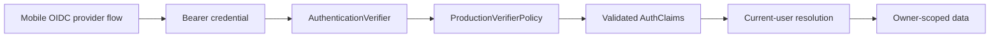

# Production Identity and Authentication Verification

## Status and authorization boundary

Phase 14 originally defined only the production identity architecture. Later
runtime work implements asymmetric OIDC/JWKS token verification with strict
issuer, audience, algorithm, lifetime, and key-ID checks. Flutter implements
authorization-code-with-PKCE through the system browser and stores access and
refresh credentials in platform secure storage.

Production authentication remains operationally unavailable until the operator
creates and qualifies a real OIDC tenant/client, exact redirects, issuer,
audience, and JWKS endpoint. Placeholder metadata is never release evidence.

## Trust boundary



Only the verifier may create trusted claims. API clients cannot supply a user ID
or override a verified subject. Configuration fails closed without exact HTTPS
metadata, and verification failures return the same generic authentication
response without logging a token or provider payload.

## Contracts

`AuthClaims` contains only:

- a bounded provider subject;
- a bounded issuer;
- one or more bounded audiences;
- optional email plus an independent `email_verified` signal;
- optional bounded display name; and
- optional timezone-aware issued and expiry timestamps.

It contains no raw credential, signature, key material, authorization header,
refresh token, provider response, or private request payload. All strings reject
surrounding whitespace, control characters, and overlong values.

The bearer boundary accepts at most 8,192 non-whitespace characters. Missing,
malformed, oversized, structurally invalid, and unavailable verification all
return a generic `401`. Internal failures use stable content-free codes.

## Production verifier policy

The production policy requires:

- one exact HTTPS issuer with no embedded credentials, query, or fragment;
- one exact non-empty audience;
- one HTTPS JWKS URL with no embedded credentials, query, or fragment;
- an explicit subset of asymmetric `ES256` and `RS256`;
- required, timezone-aware issue and expiry timestamps;
- no more than 300 seconds of clock skew;
- a token lifetime between 60 seconds and 24 hours; and
- an exact issuer and audience match.

`HS256`, unsigned tokens, algorithm inference, wildcard issuers, wildcard
audiences, HTTP metadata, embedded metadata credentials, missing time claims,
and unlimited token lifetime are not allowed.

The policy validates claims only after a future adapter has cryptographically
verified the token. It is not a token parser and it does not treat unverified JWT
payload fields as trustworthy.

## Configuration

Local and test environments may use the deterministic `development` verifier.
Staging and production require:

```text
AUTHENTICATION_VERIFIER_MODE=production_contract
AUTHENTICATION_ISSUER=https://identity.example.com
AUTHENTICATION_AUDIENCE=convocoach-api
AUTHENTICATION_JWKS_URL=https://identity.example.com/keys.json
AUTHENTICATION_ALLOWED_ALGORITHMS=ES256,RS256
AUTHENTICATION_CLOCK_SKEW_SECONDS=60
AUTHENTICATION_MAXIMUM_TOKEN_LIFETIME_SECONDS=3600
```

These public metadata values are illustrative and are not credentials.
Production development-token settings must remain empty. A production tenant,
client, redirect, Google connection, Apple connection, and end-to-end device
qualification are still operator-owned release prerequisites.

## Current-user resolution

The server resolves or provisions a user only from structurally validated claims
returned by the injected verifier. The existing `auth_subject` schema and
single-issuer assumption are unchanged; Phase 14 adds no migration or alternate
identity table.

An email is stored only when `email_verified` is true. Existing account-deletion
blocking, indistinguishable owner-resource failures, transaction rollback, and
owner scoping remain unchanged. Client-supplied IDs, unverified email addresses,
display-name identity matching, and cross-provider account linking are not
accepted.

## Mobile boundary

The Flutter domain contract exposes:

- authentication method;
- sanitized session lifecycle;
- optional server-opaque account reference; and
- user-initiated `signIn` and `signOut` operations.

It deliberately exposes no token or credential field. The implemented mobile
gateway uses the system browser, Authorization Code with PKCE, AppAuth callback,
refresh rotation, and platform secure storage. Provider-specific buttons pass
only an allowlisted broker parameter and connection name. They never receive or
handle the user's Google or Apple password.

Debug preview authentication is available only when mock mode and
`CONVOCOACH_AUTHENTICATION_MODE=mock` are both active. A release build requires
`CONVOCOACH_AUTHENTICATION_MODE=oidc`, HTTPS API/discovery metadata, a bounded
client and callback, no embedded bearer token, and at least one identity
connection. A release that enables Google but omits the Apple alternative fails
configuration validation.

Mobile public build values include:

```text
CONVOCOACH_OIDC_DISCOVERY_URL=https://identity.example.com/.well-known/openid-configuration
CONVOCOACH_OIDC_CLIENT_ID=convocoach-mobile
CONVOCOACH_OIDC_REDIRECT_URL=com.convocoach.convo-coach:/oauthredirect
CONVOCOACH_OIDC_POST_LOGOUT_REDIRECT_URL=com.convocoach.convo-coach:/logout
CONVOCOACH_OIDC_PROVIDER_PARAMETER=connection
CONVOCOACH_OIDC_GOOGLE_CONNECTION=google-oauth2
CONVOCOACH_OIDC_APPLE_CONNECTION=apple
```

Connection values depend on the selected broker. They must match its tenant
configuration; the example values are not proof that a production tenant exists.

## Privacy and logging

Credentials, claims, issuer responses, key documents, emails, subjects, and
provider errors must never enter operational logs. Release evidence may state
only verifier mode, availability, policy version, and content-free failure
codes. Correlation identifiers remain opaque UUIDs.

## Remaining production qualification

The operator must choose and threat-model the identity broker, register exact
native redirects, configure Google and Apple applications, verify signing-key
rotation and outage behavior, qualify revocation/account deletion, define
account-linking rules, and complete privacy disclosure review. Repository wiring
does not substitute for those external checks.
