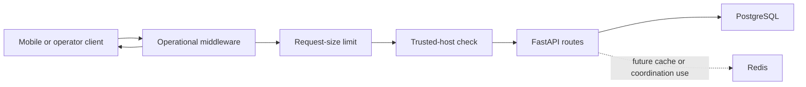

# Production Readiness and Operational Hardening

## Status and boundary

Phase 13 establishes a fail-closed operational boundary for the FastAPI process
and Flutter release builds. It does not deploy the product, activate AI, add a
production AI provider, persist AI output, change the database schema, or apply
migrations at runtime.

The only executable AI registration remains `mock-ai-provider.v1`. Server-side
AI execution and mock execution default to disabled. Production configuration
rejects either flag being enabled. The Flutter release gate also rejects mock
mode and the Conversation Coach preview.

## Request and process boundary

The outer operational middleware creates or validates one opaque correlation
UUID, adds response security headers, contains unexpected pre-response failures,
and emits one allowlisted completion record. The size limit buffers no more
than the configured maximum before routing. Trusted-host enforcement then
rejects unapproved host headers.

## Configuration architecture

`app.core.config.Settings` is the sole typed runtime configuration. Environment
parsing is strict: ambiguous booleans, non-positive limits, unsupported URL
schemes, malformed ports, duplicate hosts, unsupported environments, and
inconsistent AI flags are rejected with content-free failure codes.

| Setting | Safe local default | Production rule |
| --- | --- | --- |
| `APP_ENVIRONMENT` | `local` | exactly `production` |
| `APP_DEBUG` | `false` in code | must be `false` |
| `APP_LOG_LEVEL` | `INFO` | cannot be `DEBUG` |
| `OPENAPI_ENABLED` | `true` locally | must be `false` |
| `OPERATIONAL_CHECKS_ENABLED` | `false` locally | must be `true` |
| `MAX_REQUEST_BODY_BYTES` | 1 MiB | positive and no more than 10 MiB |
| `ALLOWED_HOSTS` | local/test hosts | explicit, non-local, no wildcard |
| `DATABASE_URL` | local PostgreSQL | non-local `postgresql+asyncpg` URL |
| `REDIS_URL` | local Redis | non-local TLS `rediss` URL |
| development auth values | local-only placeholders | must all be empty |
| AI execution flags | both `false` | must both be `false` |

Configuration errors include codes only. Connection strings, credentials, and
environment values are never placed in error text.

## Lifecycle

The application records the closed lifecycle states `created`, `starting`,
`ready`, `stopping`, and `stopped`.

During production startup:

1. Configuration is validated before an engine or application is accepted.
2. PostgreSQL connectivity is checked with `SELECT 1`.
3. The `alembic_version` value is read and compared with the expected head.
4. Redis authentication/database selection, when configured in the URL, and
   `PING` are checked over the configured TLS connection.
5. Startup fails before serving when any check is unavailable or incompatible.

The checker never invokes Alembic, creates a table, changes a row, applies a
migration, or retries indefinitely. Shutdown disposes the application-owned
database engine and records the stopped state.

## Health contracts

`GET /health/live` proves only that the process can handle HTTP. It never probes
PostgreSQL, Redis, migrations, or AI.

`GET /health/ready` reports:

- configuration: `valid` or `incomplete`;
- lifecycle: the current closed lifecycle state;
- database: `ready`, `not_ready`, `not_checked`, or `missing`;
- migrations: `compatible`, `incompatible`, or `not_checked`; and
- Redis: `ready`, `not_ready`, `not_checked`, or `missing`.

Production and staging readiness require completed operational checks.
Local/test readiness may honestly show dependencies as `not_checked`; it never
labels them ready without a connectivity check.

## Correlation and structured logging

Clients may provide one canonical UUID in `X-Correlation-ID`. Invalid values are
discarded and replaced with a random UUID. Every HTTP response, including 400,
413, and safe 500 responses, returns the request correlation identifier.

The operational JSON formatter serializes only:

- timestamp and level;
- closed event name;
- correlation identifier;
- HTTP method;
- route template, never the raw URL;
- status code and elapsed milliseconds; and
- lifecycle state for lifecycle events.

It ignores the log message, arguments, exception content, raw path, query,
headers, tokens, prompts, request/response bodies, screenshots, OCR content, and
conversation data.

## Error containment, limits, and headers

Unexpected failures before response start return only
`internal_server_error` and the correlation UUID. Oversized payloads return only
`request_too_large` and the UUID. Existing Coach preview errors retain their
versioned content-safe envelope.

HTTP responses receive:

- `Cache-Control: no-store`;
- a deny-by-default Content Security Policy;
- camera, geolocation, and microphone denial;
- `Referrer-Policy: no-referrer`;
- `X-Content-Type-Options: nosniff`; and
- `X-Frame-Options: DENY`.

Production responses additionally receive HSTS. OpenAPI JSON and Swagger UI are
available only when explicitly enabled and are required to be disabled in
production.

## Mobile release configuration

The Flutter entry point validates the compiled configuration before `runApp`.
A release build requires:

- `CONVOCOACH_ENVIRONMENT=production`;
- `CONVOCOACH_MOCK_MODE=false`;
- `CONVOCOACH_COACH_PREVIEW_ENABLED=false`;
- `CONVOCOACH_AUTHENTICATION_MODE=oidc`;
- a non-empty HTTPS API base URL;
- exact HTTPS OIDC discovery metadata, client, and registered callback;
- configured Google and Apple broker connections;
- no compiled API access token; and
- a non-empty application name.

Android release builds no longer use the debug signing key. A complete signing
property set may be supplied by a secure build environment; no or partial
secrets are stored in the repository. Local and CI qualification can produce an
unsigned release AAB. Store signing and distribution remain operator-owned.

## Privacy and security boundaries

Phase 13 adds no data collection, analytics transport, persistence, background
job, cache content, AI request, provider SDK, or outbound AI networking.
Readiness checks contain no user data. Operational logs are content-free.
Release configuration rejects embedded bearer tokens.

Phase 6A.3 physical Android and iOS native extraction qualification remains
`BLOCKED` and mandatory before production release.

## Phase 14 continuation

Phase 14 adds an exact production-authentication policy and offline release
qualification contracts. The runtime still has no production identity adapter,
so production authentication fails closed. The release evaluator also blocks
unsigned artifacts, dirty or mismatched source provenance, missing physical
qualification, enabled AI/mock behavior, and missing controlled-launch
approval. See `Production-Identity-and-Authentication-Verification.md` and
`Release-Gate-Specification.md`.

## Known limitations

- No deployment environment or production credentials are configured.
- No production authentication verifier exists.
- Redis is connectivity-checked for operations but has no application data
  contract.
- Release signing, store submission, monitoring backend, alerting transport,
  backup restoration, and physical-device qualification remain outside Phase 13.
- AI execution, including the deterministic mock, remains disabled by default
  and is forbidden by production configuration.
