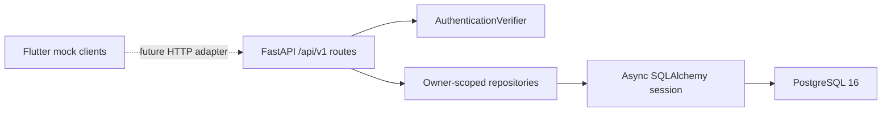

# Backend Architecture

## Phase 6A.1 boundaries

FastAPI receives a `SessionFactory` and `AuthenticationVerifier` through the
application factory. This keeps route tests deterministic and prevents provider
SDK concerns from entering route handlers. Local/test environments may use one
configured development token. Other environments use a fail-closed verifier
until a real provider adapter is supplied.

## Request lifecycle

1. `HTTPBearer` extracts the bearer credential.
2. `AuthenticationVerifier` validates it and returns trusted subject claims.
3. `UserRepository` resolves or provisions the application user from that
   subject. Client-supplied user IDs are never accepted.
4. Repositories include `owner_id` in every conversation read, write, and delete.
5. Routes commit successful mutations. The session dependency rolls back raised
   failures.

Message bodies are never logged and are absent from conversation-list responses.
Confirmed imports require the latest `save_conversation_history` decision to be
granted. The route maps validated HTTP schemas to transport-independent domain
dataclasses, then the owner-scoped repository atomically replaces draft messages
and source metadata. Screenshot content is neither accepted nor stored.
Screenshot confirmation also records validated, content-free extraction provider
and pipeline versions.

The independent event surface uses `conversation-events.v1`. Event replacement
requires active history consent and atomically changes only
`conversation_events` and `conversation_event_relationships`. Existing message
rows and response contracts are not rewritten. When no events are stored, the
event GET route returns an explicit read-time `text_message` projection with
`compatibility_mode: message_projection`; it never persists a hidden second
copy. Event metadata is depth/size bounded and rejects raw-source paths, bytes,
prompts, and direct payment/contact identifiers.

The current backend has no Redis, job, object storage, screenshot upload, OCR,
analytics, relationship scoring, AI-provider, or subscription behavior. Event
relationships are structural context and are not relationship-health scores.

## Deletion

Conversation deletion is synchronous and cascades to participants, messages,
events, event relationships, and source-disposal metadata.
Account deletion synchronously removes private child rows, redacts the user,
blocks future sessions, and creates one pending deletion request. A later hardened
worker must delete the external auth identity and complete identifier erasure.
