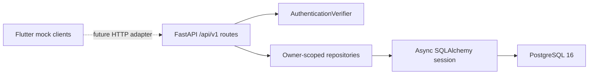

# Backend Architecture

## Phase 6A.1 boundaries

```mermaid
flowchart LR
    M["Flutter mock clients"]
    R["FastAPI /api/v1 routes"]
    A["AuthenticationVerifier"]
    P["Owner-scoped repositories"]
    S["Async SQLAlchemy session"]
    D["PostgreSQL 16"]

    M -. "future HTTP adapter" .-> R
    R --> A
    R --> P
    P --> S
    S --> D
```

FastAPI receives a `SessionFactory` and `AuthenticationVerifier` through the
application factory. This keeps route tests deterministic and prevents provider
SDK concerns from entering route handlers. Local/test environments may use one
configured development token. Other environments use a fail-closed verifier
until a real provider adapter is supplied.

## Request lifecycle

1. `HTTPBearer` extracts the bearer credential.
2. `AuthenticationVerifier` validates it and returns trusted subject claims.
3. `UserRepository` resolves or provisions the application user from that
   subject. Client-supplied user IDs are never accepted.
4. Repositories include `owner_id` in every conversation read, write, and delete.
5. Routes commit successful mutations. The session dependency rolls back raised
   failures.

Message bodies are never logged and are absent from conversation-list responses.
Confirmed imports require the latest `save_conversation_history` decision to be
granted. The route maps validated HTTP schemas to transport-independent domain
dataclasses, then the owner-scoped repository atomically replaces draft messages
and source metadata. Screenshot content is neither accepted nor stored.
Screenshot confirmation also records validated, content-free extraction provider
and pipeline versions.

The independent event surface uses `conversation-events.v1`. Event replacement
requires active history consent and atomically changes only
`conversation_events` and `conversation_event_relationships`. Existing message
rows and response contracts are not rewritten. When no events are stored, the
event GET route returns an explicit read-time `text_message` projection with
`compatibility_mode: message_projection`; it never persists a hidden second
copy. Event metadata is depth/size bounded and rejects raw-source paths, bytes,
prompts, and direct payment/contact identifiers.

The current backend has no Redis, job, object storage, screenshot upload, OCR,
analytics, relationship scoring, AI-provider, or subscription behavior. Event
relationships are structural context and are not relationship-health scores.

Phase 15 adds `app.subscriptions` as an internal, immutable catalog and pure
allowance-policy boundary. It stores INR reference prices as integer minor units,
defines exact welcome/Free/Plus allowances, and preserves the same non-paywalled
safety and privacy capability set for every plan. It has no route, persistence,
reservation, receipt, store adapter, webhook, live entitlement, or provider
execution behavior.

## Deletion

Conversation deletion is synchronous and cascades to participants, messages,
events, event relationships, and source-disposal metadata.
Account deletion synchronously removes private child rows, redacts the user,
blocks future sessions, and creates one pending deletion request. A later hardened
worker must delete the external auth identity and complete identifier erasure.

## Phase 13 operational boundary

`create_app` validates typed settings before accepting an application, records
the closed lifecycle, and can receive an injected readiness checker for
deterministic tests. Production startup requires PostgreSQL, exact migration
revision, and Redis checks to pass. No check mutates dependency state.

The request boundary orders correlation/security/error containment outside the
body-size limit and trusted-host enforcement. Completion logs use route
templates and an allowlist; request data and exception content are ignored.
OpenAPI is environment-controlled and required off in production. See
`Production-Readiness-and-Operational-Hardening.md`.

## Phase 14 production identity and qualification boundary

`app.auth.contracts` defines bounded, provider-neutral verified claims.
`app.auth.policy.ProductionVerifierPolicy` requires one exact HTTPS issuer,
audience, HTTPS JWKS URL, asymmetric `ES256`/`RS256` algorithms, bounded clock
skew, and a bounded token lifetime. Configuration selects
`production_contract` for staging and production. The factory creates
`ProductionAuthenticationVerifier`, whose PyJWT adapter resolves the configured
JWKS key, permits only configured asymmetric algorithms, verifies the signature,
exact issuer and audience, required timestamps, maximum token lifetime, and
bounded skew, and projects only minimal trusted claims. JWKS and cryptographic
work run outside the async event loop. Every parsing, key, signature, network,
or policy failure becomes the same safe authentication failure.

The bearer boundary rejects missing, oversized, whitespace-containing, and
structurally invalid credentials before current-user resolution. Only a
verifier-produced subject may key `UserRepository`, and an email is stored only
when its verifier marks it verified. The existing single-issuer
`users.auth_subject` schema is unchanged.

`app.release` contains strict immutable manifest, gate, supply-chain, and
artifact-provenance contracts plus a deterministic evaluator. It is an offline
qualification boundary, not an API route or deployment service. Its CLI parses
structured JSON without echoing invalid content or host paths and fails closed
on every missing or non-passing mandatory gate.

## Phase 16 Terra boundary

The Conversation Coach service can now choose `openai_terra` through typed
server configuration in development/staging. It reuses the authenticated,
owner-scoped, bodyless Phase 11 route, requires history consent plus separate
external-processing consent, builds a bounded context from reviewed events, and
then invokes `OpenAITerraProvider`. The route itself remains provider-agnostic.

The adapter fixes the model to `gpt-5.6-terra` and parses the Responses API
directly into `TerraCoachOutputV1`. Provider payloads never enter persistence or
logs. Public output is revalidated, evidence-linked, non-cacheable, and contains
only generated coaching, opaque event references, bounded provenance, and
content-free token counts. Production configuration permits Terra only when the
non-mock provider, strict OIDC configuration, HTTPS API, safety secret, usage
enforcement, and nonzero rate/cost ceilings are present. Deployment still
requires the external identity tenant, secrets, observability sink, and release
qualification.

## Phase 17 persistence and allowance boundary

The authenticated Flutter repository now persists an explicitly reviewed import
through the existing consent, conversation, confirmation, and
`conversation-events.v1` endpoints. It never uploads screenshot bytes, local
paths, OCR source payloads, prompts, or unreviewed drafts. A partial create is
deleted best-effort before the client surfaces a safe error.

Terra execution reserves one allowance atomically before the provider boundary.
`ai_usage_records` is a content-free reservation/completion/release ledger keyed
by owner, conversation, canonical idempotency key, and a structural request
fingerprint. Completion records token totals and an estimated micro-USD cost;
rate, per-user monthly cost, and global monthly cost ceilings fail closed before
a new provider call. Reservations acquire one consistent global guard row before
the owner row, so PostgreSQL serializes cross-user global-budget decisions.
`subscription_entitlements` accepts only server-verified
store/admin state. The public status route reports the effective plan and
allowance but never trusts client plan claims. Receipt verification and webhook
ingestion are intentionally absent until real storefront configuration exists.

## Phase 18 Z.ai GLM-5.2 boundary

Typed configuration may now select `zai_glm` for the same authenticated,
owner-bound, bodyless Coach route. The service—not the route—constructs
`ZaiGLMProvider`, fixes the model to `glm-5.2`, reserves allowance using the
provider-specific price policy, and projects only the validated public schema.
The client cannot choose the model or provider.

The adapter uses Z.ai's OpenAI-compatible Chat Completions endpoint in JSON
mode, then validates the returned JSON with the strict `GLMCoachOutputV1`
Pydantic schema and exact evidence IDs. A provider-independent deterministic
safety layer blocks under-18 romantic/sexual scenarios before the network,
adds bounded risk flags for boundary, coercion, stalking, deception, and
harassment scenarios, requires safety-only redirects for those flags, and
rejects unsafe drafts after generation. Raw prompts, responses, and message
bodies never enter logs or persistence.

## OpenRouter tiered provider boundary

Typed configuration may select `openrouter_tiered` for the same route. The usage
reservation resolves the authenticated user's server-owned plan and records the
configured model in one atomic operation: welcome/Free uses
`openai/gpt-4o-mini`, while verified Plus uses `openai/gpt-5.6-terra`.
`OpenRouterTieredProvider` owns the OpenAI-compatible Chat Completions boundary;
the API route and mobile client cannot select a model.

The adapter requests strict JSON Schema output, zero-data-retention routing,
denied provider data collection, and provider support for all request
parameters. Pydantic, evidence, token, and provider-independent safety checks
remain authoritative after generation. Model identifiers and prices are
deployment configuration, so future model changes require backend regression,
safety, and cost qualification but not a mobile release. See
`openrouter-tiered-ai-routing.md`.

## Phase 19 production packaging and qualification

The backend runtime is built from a digest-pinned Python 3.13 slim image and a
hash-locked runtime dependency set. The image contains no development tools or
secrets, performs no migration at startup, runs as UID/GID 10001, and exposes a
process-only liveness check. Readiness remains application-owned and verifies
PostgreSQL connectivity, exact Alembic revision, and Redis connectivity.

`app.release` now accepts a v2 manifest for the explicitly configured Z.ai GLM
or OpenRouter tiered path. It can
qualify only when provider validation, usage enforcement, processor review,
independent safety evaluation, deployment, store billing, restore, alerting,
legal/privacy, signing, physical-device, provenance, and controlled-launch gates
all pass. Example or local evidence cannot substitute for those operator-owned
facts.
