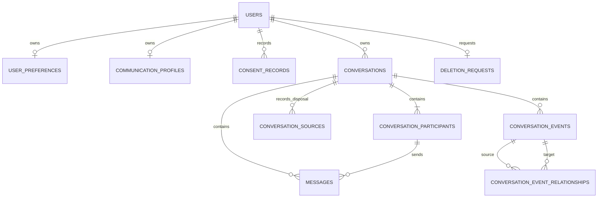

# Database Schema

The database uses PostgreSQL UUID primary keys, timezone-aware timestamps,
explicit foreign-key actions, and ownership indexes. Phase 6A.1 adds reversible
revision `20260715_0004` after the Phase 5 extraction-provenance revision.

| Table | Purpose | Deletion behavior |
| --- | --- | --- |
| `users` | Verified auth subject and minimal account identity | Soft-deleted during account deletion |
| `user_preferences` | Language, coaching style, history preference | Cascade/user deletion |
| `communication_profiles` | Explicit, user-selected communication choices | Cascade/user deletion |
| `consent_records` | Append-only consent grant/withdrawal history | Cascade/user deletion |
| `conversations` | Owner-scoped private container | Immediate hard deletion |
| `conversation_participants` | User-controlled participant labels | Cascade/conversation deletion |
| `messages` | Normalized text plus speaker, parsed/visible timestamp, OCR confidence, source index, and status | Cascade/conversation deletion |
| `conversation_sources` | Content-free source type, order, size, MIME type, and deletion status | Cascade/conversation deletion |
| `conversation_events` | Typed reviewed items, separate confidence values, provenance pointer, bounded metadata, review and soft-deletion state | Cascade/conversation deletion |
| `conversation_event_relationships` | Typed source/target links for reactions, replies, edits, captions, calls, context, and duplicates | Cascade/event deletion |
| `deletion_requests` | External identity-cleanup checkpoint | Retained while user is soft-deleted |

`conversations` records source type, draft/confirmed state, readiness,
confirmation time, and content-free extraction versions. No screenshot bytes,
paths, source digests, analysis records, relationship scores, suggestions, model
metadata, payment data, or subscriptions are included.

## Conversation-event compatibility

`Conversation-Event-Spec.md` defines the runtime implemented in Phase 6A.1.
Existing `messages` rows are neither backfilled nor rewritten. Event writes
replace only event rows, while legacy clients continue using the existing message
contracts. Event-aware reads project legacy messages to `text_message` only at
read time when a conversation has no stored events and identify that mode in the
response. Downgrading `20260715_0004` drops only the event tables.

Event metadata is limited to 16 KB and four nested levels at the API boundary.
Known screenshot bytes/paths, source paths, raw prompts, direct contact numbers,
account numbers, and UPI IDs are rejected. Database checks close the event,
speaker, and relationship vocabularies; bound confidence and source values;
require system speakers for structural events; and require unknown events to
remain reviewable. Cross-conversation relationship references are rejected by
the atomic payload validator before persistence.
