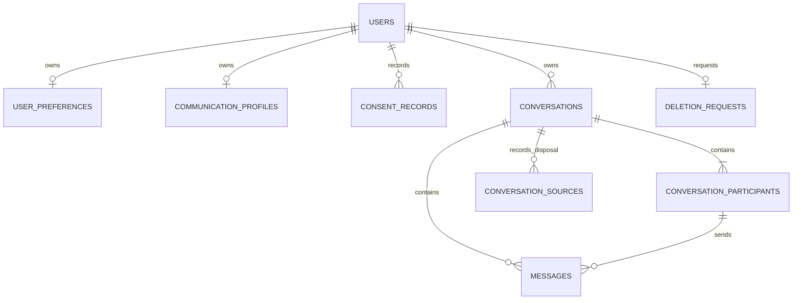

# Database Schema

The database uses PostgreSQL UUID primary keys, timezone-aware timestamps,
explicit foreign-key actions, and ownership indexes. Phase 5 adds revision
`20260714_0003` after the Phase 4 import revision.

| Table | Purpose | Deletion behavior |
| --- | --- | --- |
| `users` | Verified auth subject and minimal account identity | Soft-deleted during account deletion |
| `user_preferences` | Language, coaching style, history preference | Cascade/user deletion |
| `communication_profiles` | Explicit, user-selected communication choices | Cascade/user deletion |
| `consent_records` | Append-only consent grant/withdrawal history | Cascade/user deletion |
| `conversations` | Owner-scoped private container | Immediate hard deletion |
| `conversation_participants` | User-controlled participant labels | Cascade/conversation deletion |
| `messages` | Normalized text plus speaker, parsed/visible timestamp, OCR confidence, source index, and status | Cascade/conversation deletion |
| `conversation_sources` | Content-free source type, order, size, MIME type, and deletion status | Cascade/conversation deletion |
| `deletion_requests` | External identity-cleanup checkpoint | Retained while user is soft-deleted |

`conversations` records source type, draft/confirmed state, readiness,
confirmation time, and content-free extraction versions. No screenshot bytes,
paths, source digests, analysis records, relationship scores, suggestions, model
metadata, payment data, or subscriptions are included.
