# Phase 5: Real Conversation Extraction Engine

## Scope

Phase 5 replaces screenshot mock extraction on supported mobile devices with an
on-device Google ML Kit Text Recognition adapter. It does not perform semantic
analysis, relationship scoring, reply generation, or any other AI task. Every
result remains an untrusted draft until the user corrects and confirms it in the
existing Conversation Review Studio.

The explicit Phase 5 request supersedes the analysis-engine label in the static
roadmap in `master-build-prompt.md`. Analysis remains deferred.

## Architecture

```mermaid
flowchart LR
    A["Temporary screenshot bytes"] --> B["Image preprocessor"]
    B --> C["Google ML Kit adapter"]
    C --> D["Provider-neutral lines, boxes, confidence"]
    D --> E["Bubble grouping strategy"]
    E --> F["Speaker geometry strategy"]
    F --> G["Timestamp and ordering strategies"]
    G --> H["Overlap detector"]
    H --> I["Canonical review messages"]
    I --> J["Conversation Review Studio"]
    J --> K["User-confirmed normalization"]
```

ML Kit is used only for recognized text structure, bounding boxes, language
hints, and confidence where the native platform provides it. The adapter maps
those native objects into `RecognizedTextPage`. Bubble grouping, speaker
assignment, timestamp parsing, screenshot ordering, and overlap removal are
independent replaceable Dart strategies.

Unsupported hosts and tests retain `MockOcrEngine`. Runtime selection uses the
actual Android/iOS process, so desktop test hosts never call a method channel.

## Preprocessing

Before native recognition, each JPG, PNG, or WebP source is processed in a Dart
isolate:

- reject encoded files above 10 MB;
- inspect dimensions before pixel decoding and reject sources above 24 MiPixels;
- honor encoded JPEG orientation and bake pixel orientation;
- preserve aspect ratio while limiting output to 4096 pixels per dimension and
  8 MiPixels;
- apply bounded contrast normalization based on sampled luminance variance;
- remove EXIF, text chunks, and ICC metadata;
- encode a sanitized PNG for recognition.

HEIC/HEIF is not accepted in this phase because the provider-neutral
preprocessor cannot decode and strip it consistently on both platforms.

## Extraction Behavior

- Left- and right-edge geometry assigns `other` and `me`; centered or ambiguous
  layouts remain `unknown`.
- Numeric dates follow the device locale's month/day ordering. Complete visible
  date and time values are stored. A visible time without a visible date remains
  display-only and does not fabricate a date.
- Fully timestamped screenshots can be ordered chronologically with a review
  warning. Incomplete timestamp coverage preserves picker order and warns.
- Exact normalized message sequences at adjacent screenshot boundaries are
  deduplicated. Content inside a retained message is never rewritten.
- Confidence below 0.80 remains `Needs review`; confidence above 0.95 has no
  decoration. Missing provider confidence produces a review note.
- The session-only extraction coordinator keys requests with SHA-256 source
  digests and pipeline versions, coalesces repeated requests, caches three
  completed results, and retries transient provider failures at most twice. The
  hash is never persisted.

## Privacy Lifecycle

1. User-selected bytes enter a bounded in-memory mobile store.
2. Preprocessing creates sanitized bytes without source metadata.
3. The ML Kit adapter writes one randomized system-temporary PNG.
4. The adapter closes the recognizer and deletes its temporary directory in a
   `finally` block on success, failure, or post-processing cancellation.
5. Processing-only cancellation retains original in-memory bytes for a safe
   manual retry.
6. Abandoning the import clears original bytes and invalidates extraction state.
7. Saving confirmed normalized messages clears original bytes and persists only
   message data, source-disposal metadata, and content-free extraction versions.

No screenshot bytes or paths are sent to FastAPI. Production code has no raw
OCR/screenshot logging.

## Persistence

Alembic revision `20260714_0003` adds nullable `extraction_metadata` to
`conversations` and `visible_timestamp_text` to `messages`. Screenshot
confirmation requires provider, provider version, extraction version,
preprocessing version, and confidence availability. Extra metadata/source fields
and estimated timestamps are rejected. Paste imports cannot supply OCR
provenance.

## Limitations

- Google ML Kit method-channel execution requires a physical/simulated Android
  or iOS runtime and cannot be exercised by macOS Flutter unit tests.
- The bundled adapter includes the Latin text model only. Additional script
  models and script selection are deferred.
- The Flutter plugin reports line/element confidence on Android; iOS may return
  no confidence.
- Native ML Kit calls cannot be interrupted mid-call. Cancellation prevents
  later stages and discards the result after the native call returns.
- Bubble grouping is conservative and cannot recover visual bubble backgrounds,
  reactions, quoted replies, stickers, or every chat application's layout.
- All screenshots and tests are synthetic. A consented physical-device corpus
  and correction-rate benchmark remain required before release.
