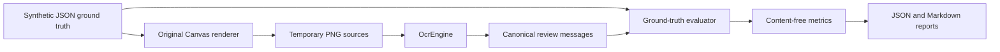

# Phase 6A: Native Extraction Qualification and Benchmarking

## Scope

Phase 6A qualifies the existing extraction engine against original synthetic
dating-chat screenshots. It adds no conversation analytics, semantic inference,
relationship scoring, dashboard, generation, payment, or subscription behavior.
Every image and transcript in the suite is synthetic.

The static roadmap's Phase 6 dashboard is superseded by the explicit Phase 6A
request. Phase 6B must not begin until the native quality gates in this document
are satisfied on both Android and iOS.

## Fixture System

Ground truth is stored as versioned JSON under
`apps/mobile/assets/benchmark/phase6a`. Flutter Canvas renders each definition
to a temporary metadata-free PNG at benchmark runtime. The renderer uses
original colors, spacing, geometry, headers, and bubble treatments. Product
names are descriptive coverage labels only; no proprietary logo, asset, exact
layout, icon system, screenshot, or copy is included.

The native integration target reads a generated Dart catalog so benchmark JSON
does not need to be declared as a customer application asset. Regenerate it from
`apps/mobile` after editing ground truth:

```bash
dart run tool/generate_phase6a_fixture_catalog.dart
```

Host tests compare the generated catalog with every reviewable JSON file. The
normal release application does not import the harness or bundle the corpus.

| Original archetype | Coverage |
| --- | --- |
| Dense thread | WhatsApp-style density, dark mode, Hinglish, compact screen, overlap |
| Match stream | Tinder-style rhythm, light mode, Roman Hindi, large screen, low contrast |
| First move | Bumble-style opening pattern, dark mode, English, emoji-only, reaction |
| Prompt thread | Hinge-style long replies, light mode, cropped image, missing timeline |
| Social DM | Instagram DM-style rhythm, dark mode, Hinglish, reactions, out-of-order pages and timeline gap |
| Event timeline | Original light, low-contrast mixed-language layout with deleted, media, encryption, and unread items |
| Reaction lab | Original dark, emoji-heavy, reaction-heavy mixed English/Hinglish layout |

Each fixture defines expected messages, speakers, final order, visible and
resolved timestamps, duplicate IDs, warning codes, reference confidence, manual
review expectations, source order, screen size, language, and scenario traits.
Reaction overlays are separate visual ground truth and are not silently treated
as canonical messages.

Generated fixture workspaces are deleted after every benchmark case, including
failure and cancellation. The committed JSON is intentionally human-reviewable;
generated PNGs and reports remain ignored build artifacts.

## Evaluation Architecture



The reference host run uses `RealConversationOcrEngine`, the real image
preprocessor, and deterministic provider-neutral recognized lines generated with
the fixtures. It validates preprocessing, grouping, speaker geometry,
timestamps, ordering, deduplication, evaluation, cancellation, and cleanup. It
does not measure ML Kit recognition quality.

Android and iOS integration targets replace only the text provider with
`GoogleMlKitTextRecognitionProvider`. They therefore exercise the same
preprocessor, extraction strategies, normalizer boundary, fixtures, evaluator,
and report exporter.

Production extraction now returns content-free diagnostics: processed image
count, candidate count, duplicate count, unknown-speaker count, and ordered
source indices. It returns no image bytes, text samples, source paths, or hashes
through that diagnostic channel.

## Metrics

- Character and word accuracy use normalized Levenshtein distance over the final
  expected and extracted transcript sequences.
- Message extraction uses monotonic similarity alignment and penalizes missing
  and extra messages.
- Event classification compares the complete typed event multiset, including
  message-projecting media, structural items, dates, and recognized reactions.
- Speaker and timestamp accuracy use aligned message pairs; a missing or
  fabricated timestamp is incorrect.
- Duplicate accuracy compares structured expected and removed counts.
- Ordering accuracy compares structured expected and actual source-index order.
- Warning accuracy compares warning-code sets, including the confidence fallback
  required when a provider exposes no confidence.
- Manual review rate includes low confidence, unknown speaker, empty content, or
  every message when confidence is unavailable.
- Confidence calibration reports review recall and precision against designated
  synthetic review cases.
- Review Studio correction counts include text, speaker, timestamp, missing,
  extra, and ordering corrections.
- Latency covers extraction after fixture generation. RSS is sampled every 10 ms
  where `ProcessInfo.currentRss` is available; it is process-level and approximate,
  not an operating-system profiler replacement.
- Failures record exception categories only. Cancellation uses a pre-cancelled
  extraction probe and the existing mid-flight cancellation tests.

## Reports

Reports are written to `build/phase6a-benchmark/<run>/report.json` and
`report.md`. Version 2 adds hardware model, OS, Flutter, ML Kit, extraction and
benchmark versions; session duration and outcome; peak memory; failure and
cancellation counts; and an explicit `PASS` or `BLOCKED` status. The committed
schema lives under `apps/mobile/benchmark/phase6a/schema`. Reports contain
fixture IDs, scenario tags, provider versions, metrics, cleanup state, and safe
failure categories. They never contain screenshots, OCR output, expected
transcript text, source paths, source hashes, device IDs, or user device names.

Run the platform-independent reference suite from `apps/mobile`:

```bash
flutter test benchmark/phase6a_reference_benchmark_test.dart --reporter expanded
dart run tool/run_phase6a2_native.dart
```

The common runner first emits a content-free capability report. It executes a
platform target only when Flutter, the required native toolchain, and a supported
physical device are all present. Use `tool/run_phase6a2_android.dart` and
`tool/run_phase6a2_ios.dart` for platform-specific runs. Full architecture,
comparison thresholds, and current readiness evidence are documented in
`phase-6a2-native-device-readiness.md`.

The Phase 6A.3 execution attempt is documented in
`phase-6a3-physical-native-qualification.md`. On 2026-07-15 it stopped
truthfully at the prerequisite gate: the workstation had Flutter 3.44.6 but no
Android SDK, complete Xcode, CocoaPods, or qualifying physical device. No native
run occurred, no production code changed, and Phase 6B did not start.

## Physical Android

Prerequisites: Android SDK, accepted licenses, an API 23 or newer physical
device with developer mode and USB debugging, and the device visible in
`flutter devices`.

```bash
flutter devices
PHASE6A_PLATFORM_LABEL=android flutter drive --release \
  --driver=test_driver/phase6a_benchmark_driver.dart \
  --target=integration_test/phase6a_android_benchmark_test.dart \
  -d <ANDROID_DEVICE_ID>
```

Run once on a representative mid-range Android phone and once on a current
flagship. Repeat each run to establish consistency.

## Physical iOS

Prerequisites: complete Xcode, CocoaPods, signing configured for Runner, an iOS
15.5 or newer physical device, and the device visible in `flutter devices`.

```bash
cd ios
pod install
cd ..
flutter devices
PHASE6A_PLATFORM_LABEL=ios flutter drive --release \
  --driver=test_driver/phase6a_benchmark_driver.dart \
  --target=integration_test/phase6a_ios_benchmark_test.dart \
  -d <IOS_DEVICE_ID>
```

Run on one current and one older supported iPhone, repeating each run.

## Phase 6B Quality Gates

Every required gate must pass in two consecutive runs on each required physical
device class. A host reference report cannot satisfy the native-device gate.

| Gate | Requirement |
| --- | ---: |
| Character accuracy | at least 95% overall |
| Word accuracy | at least 90% overall |
| Message extraction accuracy | at least 95% |
| Event classification accuracy | at least 95% |
| Minimum message accuracy for any fixture | at least 90% |
| Speaker assignment accuracy | at least 95%, with ambiguous speakers left unknown |
| Timestamp accuracy | at least 98%, with zero fabricated timestamps |
| Duplicate-removal accuracy | at least 95% |
| Screenshot ordering accuracy | 100% |
| Warning-code accuracy | at least 90% |
| Expected low-quality review recall | at least 95% |
| Manual review rate when confidence exists | no more than 30% |
| iOS confidence fallback | explicit unavailable warning and full manual review |
| P95 extraction latency | no more than 2.5 seconds per fixture suite case |
| Peak RSS increase where measurable | no more than 200 MiB |
| Cleanup | 100% on success, failure, and cancellation |
| Stability | no crashes, hangs, OOMs, or failed fixture cases |
| Completion | zero cancelled fixture cases and a passing cancellation probe |

The English, Hinglish, Roman Hindi, emoji-only, low-contrast, long-message,
cropped, overlap, out-of-order, compact, and large-screen cases must all be
represented in each full run. Any failed case blocks Phase 6B until it is fixed,
the fixture is rerun, and the reason is documented.

## Privacy Review

- Only synthetic text is committed or processed by the benchmark.
- Screenshots are generated in a randomized temporary directory and deleted in
  `finally` paths.
- Native ML Kit working images retain the Phase 5 per-attempt deletion behavior.
- Reports contain aggregate and per-fixture metrics only.
- Production code does not log screenshots, extracted content, paths, or hashes.
- Native report transfer uses integration-test report data containing metrics,
  not image or transcript payloads.

## Current Limitations

- Phase 6A.3 is `BLOCKED`. There are zero qualifying Android runs and zero
  qualifying iOS runs, so the required repeated native reports, physical
  accessibility smoke checks, and cross-run comparisons do not exist.
- Flutter 3.44.6 now detects a complete Android SDK and CocoaPods. No physical
  mobile device or full Xcode is available, so no native ML Kit result is
  claimed. Android APK preflight also exposes an existing CargoKit/Gradle 9.1
  compatibility defect that remains outside the authorized production scope.
- The current ML Kit adapter bundles only the Latin recognizer. Hinglish and
  Roman Hindi are covered; native-script Hindi remains deferred.
- Phase 6A.1 now represents recognized reactions as typed events with reviewable
  targets and excludes them from the message projection. The deterministic
  compact-heart regression passes the host reference suite, but native reaction
  recognition and target quality are not qualified until the documented physical
  Android and iOS suites pass.
- RSS sampling is approximate and must be supplemented with Android Studio and
  Xcode profiling before release.
- Synthetic archetypes exercise comparable geometry but cannot prove quality on
  every app version, font, accessibility setting, or screenshot compression path.
