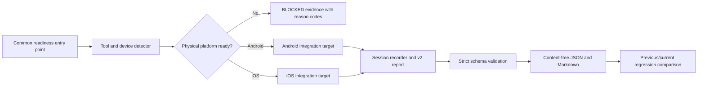

# Phase 6A.2: Native Device Readiness

## Outcome

Phase 6A.2 makes native extraction qualification repeatable and auditable without
claiming evidence from a host, simulator, or missing toolchain. It adds no
customer feature, analytics, AI/GPT integration, scoring, coaching, payment,
subscription, cloud sync, migration, or API change. The production OCR, event,
review, normalization, and persistence boundaries remain unchanged.

The repository is ready to run the complete synthetic suite on a supported
physical Android or iOS device. The current workstation is still `BLOCKED` for
both platforms because it has no Android SDK or physical Android device, and no
complete Xcode, CocoaPods, or physical iOS device. That is deferred physical
evidence, not a benchmark failure and not a release qualification.

## Qualification architecture



The readiness detector probes Flutter, Android SDK/ADB, Xcode, CocoaPods, and
`flutter devices --machine`. A platform can pass readiness only with Flutter,
its required toolchain, and a supported physical device. Emulators and
simulators are visible as non-qualifying capability facts. Device command IDs
and user-assigned names are retained only in memory long enough to target
`flutter drive`; they are never serialized into evidence.

The runners are:

- `tool/run_phase6a2_android.dart` for Android;
- `tool/run_phase6a2_ios.dart` for iOS; and
- `tool/run_phase6a2_native.dart` for one or both platforms.

They invoke the existing platform-specific integration targets and common test
driver. A blocked prerequisite returns process exit code 2 and writes a
content-free reason report instead of attempting the benchmark.

## Benchmark session and result contract

Every v2 benchmark report records:

- hardware model, operating-system version, Flutter version, ML Kit adapter
  version, extraction version, and benchmark version;
- UTC start and completion times plus elapsed milliseconds;
- measured process peak RSS and peak RSS delta where available;
- completed, failed, or cancelled outcome;
- success, failure count, cancelled-case count, and cancellation-probe result;
- aggregate and per-fixture metrics; and
- explicit `PASS` or `BLOCKED` quality-gate status.

The versioned JSON Schema is
`apps/mobile/benchmark/phase6a/schema/benchmark-result-v2.schema.json`. The Dart
writer also applies an exact-field validator before writing reports. Failed
cases contain stable exception categories only. Reports cannot contain OCR text,
expected transcripts, screenshots, source paths, source hashes, device IDs, or
user-assigned device names.

## Quality gates and comparison

Phase 6A.2 adds typed-event classification accuracy to the existing extraction
gates. Required gates include zero failed and zero cancelled fixture cases,
successful cancellation cleanup, complete temporary-file cleanup, and a true
physical-device run. A host reference result is therefore expected to remain
`BLOCKED` only on `native_device_run` after every platform-independent gate
passes.

Compare a new report with a previous report from `apps/mobile`:

```bash
dart run tool/compare_phase6a_benchmarks.dart \
  build/phase6a-benchmark/previous/report.json \
  build/phase6a-benchmark/current/report.json
```

The comparison flags accuracy drops over 0.5 percentage points, manual-review
increases over 2 points, new failed/cancelled cases, cleanup drops, PASS-to-
BLOCKED changes, latency increases over both 15 percent and 100 ms, and memory
increases over both 20 percent and 10 MiB. Accuracy, failures, cancellation,
cleanup, and gate-state regressions are blocking; performance deltas are
reported for investigation. Comparison exports are aggregate and content-free.

## Expanded original synthetic coverage

The corpus now contains seven original fixtures. The two Phase 6A.2 additions
cover a light, low-contrast English/Hinglish/Roman-Hindi event timeline with
deleted, image, voice-note, encryption, and unread items, plus a dark,
emoji-heavy, reaction-heavy mixed-language layout. Together with the existing
fixtures, the suite covers light/dark themes, English, Hinglish, Roman Hindi,
emoji-only messages, reactions, overlap, crops, missing timeline sections,
out-of-order screenshots, low contrast, compact screens, and large screens.

Reaction-heavy visual overlays that are not expected to produce OCR text remain
explicit in ground truth. A separately recognized compact reaction exercises
typed reaction classification and target attachment. This distinction prevents
decorative overlay density from silently becoming expected transcript content.

## Commands

From `apps/mobile`:

```bash
dart run tool/generate_phase6a_fixture_catalog.dart
flutter test benchmark/phase6a_reference_benchmark_test.dart --reporter expanded
dart run tool/run_phase6a2_native.dart
dart run tool/run_phase6a2_android.dart --device-id=<PHYSICAL_DEVICE_ID>
dart run tool/run_phase6a2_ios.dart --device-id=<PHYSICAL_DEVICE_ID>
```

The common command writes readiness evidence under
`build/phase6a-readiness`. Successful platform benchmarks write v2 reports under
`build/phase6a-benchmark/android` or `build/phase6a-benchmark/ios`. These are
ignored build artifacts; only the synthetic JSON definitions and schema are
committed.

## Current evidence and limitations

- The seven-fixture provider-neutral reference run passes every
  platform-independent gate. It does not invoke ML Kit and cannot satisfy the
  native-device gate.
- The local capability report detects Flutter 3.44.6 and no qualifying mobile
  device. Android is blocked by missing Android SDK and physical device. iOS is
  blocked by incomplete Xcode, missing CocoaPods, and physical device.
- ML Kit OCR accuracy, native latency, native memory behavior, and classifier
  quality remain unverified until the documented physical suites run.
- RSS is process-level sampling, not a substitute for Android Studio or Xcode
  profiling.
- Original synthetic fixtures qualify defined geometry and text cases; they do
  not prove behavior for every third-party app version, font, compression path,
  language script, or accessibility configuration.
- Phase 6B has not started. It remains blocked until the required repeated
  physical Android and iOS evidence passes and is reviewed.

## Verification on this workstation

The completed Phase 6A.2 verification pass produced these results:

- Dart formatting check and `flutter analyze`: passed with no findings;
- `flutter test`: all 82 tests passed;
- provider-neutral seven-fixture reference benchmark: all
  platform-independent gates passed, with `native_device_run` correctly
  `BLOCKED`;
- Flutter release bundle: built successfully;
- Ruff format/lint, MyPy, and `pip check`: passed;
- Pytest: all 43 tests passed with warnings treated as errors;
- isolated PostgreSQL upgrade, downgrade to `20260714_0003`, re-upgrade, and
  Alembic drift check: passed;
- Docker Compose configuration, CI YAML, fixture/schema JSON, and
  `git diff --check`: passed;
- self-comparison of the v2 reference report: `NO_REGRESSION`; and
- native readiness command: expected exit 2, with both platform reports
  `BLOCKED` only by the missing toolchain/device reason codes listed above.

## Phase 6A.3 execution outcome

The unchanged readiness workflow was executed again for Phase 6A.3 on
2026-07-15. The initial run found no native toolchain. Android Studio, the
required Android SDK/ADB packages and licenses, and CocoaPods were then
installed. The current capability result blocks Android only on the missing
physical Android device and iOS on missing complete Xcode and a physical iOS
device. An Android APK preflight also found an existing
`irondash_engine_context`/Gradle 9.1 incompatibility; it remains unfixed pending
separate authorization. No native benchmark was attempted, no production or
benchmark code was changed, and Phase 6B did not start.

The full content-free evidence, platform-independent regression results,
unperformed native checks, and next prerequisites are recorded in
`phase-6a3-physical-native-qualification.md`.
