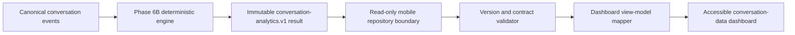

# Phase 7: Conversation Health Dashboard Foundation

## Status

`IMPLEMENTED` for the bounded read-only presentation scope. Final repository
verification is recorded below. Phase 6A.3 remains `BLOCKED`; physical Android
and iOS qualification is still mandatory before production release.

The implementation uses the product phrase **conversation data** in customer
copy. It does not describe a relationship, person, or conversation as healthy
or unhealthy. The phase title is retained only to match the authorized roadmap
name.

## Outcome

Phase 7 adds an accessible Flutter presentation layer for immutable Phase 6B
analytics. It displays only deterministic values supplied through a read-only
repository boundary. The mobile app does not reproduce a Phase 6B formula,
inspect conversation text, infer meaning, score a person or relationship, or
generate advice.

The default repository returns no result because Phase 7 does not authorize a
new backend route. The app therefore shows an honest empty state until a later
authorized transport supplies a genuine `conversation-analytics.v1` snapshot.
Synthetic, content-free snapshots are injected only by tests.

## Architecture

The backend remains the only authoritative calculation owner. Mobile mapping is
limited to:

- selecting documented metric identifiers for sections;
- formatting supplied counts, percentages, and seconds for display;
- preserving unsupported results and their stable reasons;
- counting supplied supported/unsupported statuses for the data-quality summary;
- exposing supplied structural evidence identifiers behind a developer detail;
  and
- rejecting unknown versions, duplicate identifiers, missing required metrics,
  invalid value/unit combinations, and contradictory availability states.

## Mobile contracts and state

The mobile projection recognizes only:

- result schema `conversation-analytics.v1`;
- calculation version `deterministic-conversation-analytics.v1`; and
- source schema `conversation-events.v1`.

The immutable projection includes typed numeric, identifier, and reaction-count
values; evidence event and relationship IDs; per-metric quality; overall
quality; and the three versions. It deliberately excludes formulas, message
text, captions, OCR output, screenshots, source paths, participant names,
prompts, and timestamps unrelated to deterministic metric values.

Riverpod exposes loading, empty, unsupported-data, error, and ready states.
Repository injection keeps the presentation independently testable without a
network, database, or Phase 6B reimplementation.

## Dashboard sections

The ready state contains:

- conversation summary: supplied contribution totals, participant totals,
  elapsed duration, and active duration;
- participation: supplied session, contribution, event-share, initiation, and
  consecutive-run metrics;
- timing: supplied response intervals and observed unanswered-question duration;
- questions: literal-question total, explicit answers, and unanswered total;
- replies: explicit and orphan structural reply references;
- reactions: sent/received counts, reviewed types, and targets;
- media: image, video, voice-note, document, link, and location counts;
- timeline structure: gaps, duplicates, unknowns, and structural events; and
- data quality: supported/unsupported totals, evidence sufficiency, and every
  supplied missing-data reason.

Unsupported metrics remain in their section with `Not available` and a textual
reason. Timeline gaps produce a text-and-icon notice; color is never the only
status signal. Content-free evidence UUIDs and version details are available in
a collapsed developer section and never include user content.

## Accessibility and motion

- Section titles are semantic headings.
- Every metric has one screen-reader label containing its label, displayed
  value, and evidence/unsupported status.
- Icons are paired with text; status is not communicated by color alone.
- Layouts use wrapping, flexible rows, scrollable content, and shared semantic
  tokens to support compact screens, dark/light themes, and 200 percent text.
- The global motion preference continues to honor platform reduced-motion
  settings. Phase 7 adds no decorative or blocking animation.
- The developer disclosure uses the platform keyboard- and screen-reader-aware
  expansion control.

## Privacy and safety

- No new API, database migration, table, analytics history, cache, file export,
  screenshot, or report is created.
- No analytics value, evidence identifier, conversation text, OCR output, or
  private payload is logged.
- The default app does not fabricate preview metrics.
- Developer evidence contains only engine-supplied event UUIDs, relationship
  UUIDs, and version strings.
- Copy states that the data does not measure interest, compatibility, or
  relationship quality.
- No score, green/red flag, behavioral interpretation, AI, GPT, coaching,
  advice, reply generation, first-message generation, attraction inference,
  or personality inference is present.

## Tests

`apps/mobile/test/phase7_dashboard_test.dart` covers:

- immutable input and view-model collections;
- faithful mapping of supplied values;
- supported/unsupported aggregation;
- unknown-version and incomplete-contract rejection;
- empty and loading states;
- dedicated unsupported-data rendering;
- visible timeline-gap and unsupported-metric presentation;
- screen-reader semantics for unavailable data;
- content-free developer evidence;
- compact-screen 200 percent text behavior; and
- repository injection without a live backend.

## Files created

- `apps/mobile/lib/features/conversation_dashboard/domain/conversation_analytics_snapshot.dart`
- `apps/mobile/lib/features/conversation_dashboard/domain/conversation_analytics_repository.dart`
- `apps/mobile/lib/features/conversation_dashboard/domain/dashboard_view_model.dart`
- `apps/mobile/lib/features/conversation_dashboard/application/conversation_dashboard_mapper.dart`
- `apps/mobile/lib/features/conversation_dashboard/application/conversation_dashboard_controller.dart`
- `apps/mobile/lib/features/conversation_dashboard/presentation/conversation_dashboard_screen.dart`
- `apps/mobile/test/phase7_dashboard_test.dart`
- `docs/phase-7-conversation-health-dashboard.md`

## Changed integration points

- The app router adds `/conversations/:conversationId/dashboard`.
- A saved conversation detail can open its conversation-data dashboard.
- The Flutter test helper accepts an optional analytics repository override.

## Expected unchanged boundaries

- Backend domain engine and metric formulas: unchanged.
- Public and internal API routes: unchanged.
- Database and migrations: unchanged.
- Analytics persistence and history: absent.
- Canonical events, Review Studio, OCR, and extraction: unchanged.
- Phase 6A fixtures, thresholds, reports, and native runners: unchanged.
- AI, scoring, coaching, and generation: absent.

## Verification results

The final automated pass produced these results:

- Flutter dependency resolution and both Dart formatting passes succeeded; the
  formatter emitted a non-blocking package-include warning while `flutter
  analyze` resolved the same configuration and returned no findings;
- all 90 Flutter tests passed, including eight focused Phase 7 tests;
- the seven-fixture Phase 6A provider-neutral reference benchmark passed;
- the Android release AAB rebuilt successfully at 74,580,565 bytes;
- Ruff formatting and lint passed across the backend;
- strict MyPy passed across 47 source files;
- all 56 backend tests passed with warnings treated as errors;
- `pip check` reported no broken backend requirements;
- Docker Compose configuration validation passed;
- the existing isolated PostgreSQL database on loopback port 55432 passed
  upgrade to head, downgrade to `20260714_0003`, re-upgrade, and Alembic drift
  checking;
- no Phase 7 backend API or migration change exists;
- source scans found no logging, network, local persistence, OpenAI/GPT,
  scoring, or green/red-flag implementation in the Phase 7 feature;
- the release archive member scan found no Phase 6A benchmark paths or
  synthetic fixture identifiers; and
- `git diff --check` passed.

An initial migration command omitted the isolated database URL and failed
authentication against the default port before any migration ran. It did not
change data. The complete required cycle was immediately repeated against the
existing isolated database and passed.

Physical-device qualification is intentionally not claimed by this phase and
remains blocked.

## Known limitations

- Phase 7 defines the presentation and injection boundary only. With no
  authorized analytics transport, the production repository returns an empty
  result.
- Duration conversion and labels are display formatting, not canonical metric
  calculation. The backend remains the source of every value.
- Physical Android/iOS extraction, performance, cleanup, cancellation, and
  accessibility qualification remain unverified while Phase 6A.3 is blocked.
